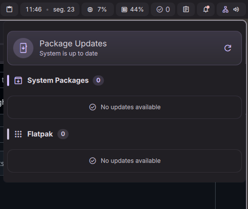

# DMS Package Updates

A [](https://www.debian.org/)

A [DankMaterialShell](https://github.com/AvengeMedia/DankMaterialShell) widget that checks for pending **APT** and **Flatpak** updates and lets you run them directly from the bar.

Based on the original plugin by Rahul Mysore: https://github.com/rahulmysore23/dms-pkg-update

## Credits

- Original plugin: Rahul Mysore — https://github.com/rahulmysore23/dms-pkg-update

## Features

- Shows total pending update count in the bar pill
  -- Lists available APT package updates with version numbers
- Lists available Flatpak app updates with remote origin
  -- **Update APT** button — opens a terminal and runs `sudo apt update && sudo apt upgrade -y`
- **Update Flatpak** button — opens a terminal and runs `flatpak update -y`
- Configurable refresh interval
- Configurable terminal application

## Screenshot



## Installation

### From Plugin Registry (Recommended)

```bash
dms plugins install pkgUpdate
# or use the Plugins tab in DMS Settings
```

                              |

## Requirements

- `apt` (standard on Debian/Ubuntu-based systems)
- `flatpak` (optional, can be disabled in settings)
- A terminal emulator that accepts `-e` to run a command

## License

MIT
